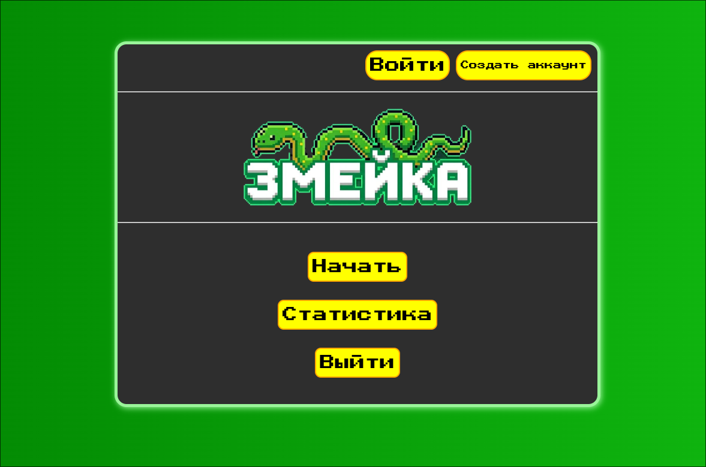

# WEBSnake — Интерактивная веб-игра «Змейка» с контейнеризацией в Docker

Классическая аркадная игра «Змейка», реализованная на чистом JavaScript (Vanilla JS) с полноценной клиент-серверной архитектурой. Проект полностью контейнеризирован с использованием Docker и Docker Compose для мгновенного локального развертывания.



## 🚀 Технологический стек
* **Frontend:** JavaScript (ES6+), HTML5 Canvas API, CSS3
* **Backend:** Node.js, Express (REST API для авторизации и ведения статистики)
* **Database:** SQL / Локальная база данных (хранение аккаунтов и рекордов)
* **DevOps & Infrastructure:** Docker, Docker Compose, Bash (скрипты автоматизации)

## ✨ Инженерные и архитектурные решения
* **Полная контейнеризация:** Серверная часть изолирована в Docker с помощью кастомного `snake.dockerfile` на базе легковесного и безопасного образа Node-Alpine.
* **Автоматизация запуска:** Написан Bash-скрипт `entrypoint.sh` для автоматической подготовки среды, проверки деплоя и безопасного старта Node.js сервера внутри контейнера.
* **Модульная структура фронтенда:** Игровая логика инкапсулирована в директорию `game/` (расчет координатной сетки, ускорение цикла, обработка коллизий), интерфейсы — в `form/`, а вывод глобального лидерборда — в `statistic/`.

## 📁 Структура проекта

```text

├── game/               # Логика игрового процесса (движение, еда, коллизии)
├── form/               # Компоненты форм регистрации и авторизации пользователей
├── statistic/          # Модуль отображения и обработки игровой статистики
├── styles/             # Глобальные и модульные CSS стили проекта
├── scripts/            # Вспомогательные JS утилиты
├── image/              # Графические ассеты игры
├── index.html          # Главная точка входа приложения (клиент)
├── server.js           # Бэкенд-сервер на Node.js (REST API)
│
├── snake.dockerfile    # Спецификация Docker-образа для Node.js сервера
├── docker-compose.yml  # Оркестрация контейнеров приложения и базы данных
├── entrypoint.sh       # Bash-скрипт управления запуском внутри контейнера
├── .gitignore          # Исключение локального мусора (node_modules) из Git
└── README.md           # Документация проекта
```

## 🐳 Быстрый запуск (Docker)

Инфраструктура проекта полностью автоматизирована. Для сборки образов и запуска проекта выполните одну команду в терминале вашего Arch Linux:

```bash
sudo docker-compose up --build
```
После запуска:
- Фронтенд: [http://localhost:8080](http://localhost:8080)
- API сервер: [http://localhost:3000](http://localhost:3000)